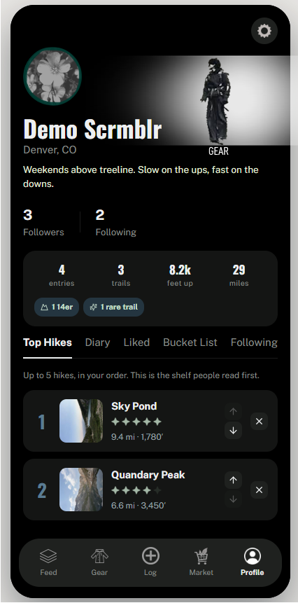
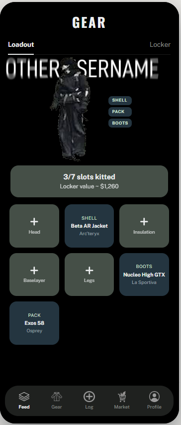

<div align="center">
  
  <p><em>A social hike log</em></p>
</div>

---

## What it is

SCRMBL is a cross-platform mobile app for logging hikes, reviewing trails, and sharing the gear you carried. You log a summit the way you'd log a film: a rating, a written review, photos, and the kit you brought. Your profile becomes a record of where you've been.

It's built around three pillars:

- **Hike** — log summits, write reviews, track personal stats, and browse a map of the trail you actually walked
- **Gear** — catalogue your kit, build named loadouts, and see what other hikers carried on the same trail
- **Community** — a feed of friends' logs, trail beta pinned to real map coordinates, and profiles you can browse by handle

## Screens

| | |
|---|---|
|  |  |
| Your gear locker | Another hiker's kit |

## Stack

**Client** — React 19 (Create React App), packaged for iOS and Android with **Capacitor 8**. One React codebase runs as a web app and ships as a native binary.

**Map** — Leaflet + React-Leaflet, rendering OpenStreetMap-derived trail geometry over dark OpenTopoMap tiles.

**Server** — Express 4 on Node, with **SQLite** for persistence and `express-session` cookie auth.

**Notable libraries** — `exifr` for reading GPS out of uploaded hike photos, `@imgly/background-removal-node` for server-side subject cutouts used in the Discover spotlight card.

## Architecture

The client is deliberately thin on state plumbing. Each backend resource follows the same four-layer path, which keeps features predictable to add:

```
SQLite table  →  REST routes  →  React hook  →  Screen
   logs           /api/logs       useLogs()      HikeScreen
   gear           /api/gear       useGear()      GearScreen
   top_hikes      /api/top        useTop()       ProfileScreen
```

Eleven tables back the app (`users`, `logs`, `gear`, `kits`, `bucklist`, `top_hikes`, `pois`, `trail_geometry`, `likes`, `custom_hikes`, `won`), exposed over roughly forty REST endpoints. Session state lives in an HTTP-only cookie; `requireAuth` middleware gates every write.

### Things I found interesting to build

- **Trail auto-matching** (`server/trailMatcher.js`) — when you log a hike, the server tries to resolve your free-text trail name against cached OSM geometry so the map can draw the real path without you picking from a list.
- **Photo geotagging** — uploaded hike photos are parsed client-side with `exifr`; if they carry GPS, the pins drop onto the trail map automatically.
- **Reward integrity** — achievements only pay out karma on data that's hard to fake (catalogue-backed trails, park visits). Badges that keyed off self-reported finish times were deliberately removed, because a competitive reward on a self-typed number isn't a reward, it's an honor system with a leaderboard.
- **Park passport stamps** — circular badges that unlock per national/state park the first time you log a hike inside it, drawn with curved text on a stamp path.

## Running it locally

Two processes — the API and the client.

```bash
# 1. API server  (http://localhost:3001)
cd scrmbl-app/server
npm install
npm start          # or: npm run dev  for nodemon

# 2. React client (http://localhost:3000)
cd scrmbl-app
npm install
npm start
```

The SQLite database is created on first run. To populate it with demo trails, gear, and community logs:

```bash
cd scrmbl-app/server
node seedGear.js && node seedLogs.js && node seedTop.js
node seedPois.js && node seedTrailGeometry.js
```

### Configuration

The session signing secret falls back to a development default so local setup works with no configuration. **Set a real one before deploying anywhere:**

```bash
export SESSION_SECRET="<a long random string>"
```

### Native builds

```bash
cd scrmbl-app
npm run build
npx cap sync
npx cap open ios       # or: npx cap open android
```

## Project status

Working prototype, actively built. Auth, hike logging, gear, kits, the trail map, karma levels, and park stamps are implemented and running against the real backend. It is not deployed — everything runs locally.

## A note on how this was built

I built this with heavy use of an AI coding assistant, and the commit history reflects that honestly via `Co-Authored-By` trailers. The architecture decisions, product design, and feature direction are mine; I'm happy to walk through any file in this repo and explain why it works the way it does.

## License

**Source-available for review — not open source.** You're welcome to read, download, and run this to evaluate my work. Copying, modifying, redistributing, or reusing it in another project isn't permitted without written permission. See [LICENSE](LICENSE) for the full terms.

Trail geometry in `scrmbl-app/server/seedTrailGeometry.json` is derived from OpenStreetMap, © OpenStreetMap contributors, licensed under the [ODbL](https://opendatacommons.org/licenses/odbl/1-0/) — that data is not covered by the terms above. Map tiles are served at runtime by OpenTopoMap (CC BY-SA 3.0).

---

<sub>Personal project by Chris.</sub>
